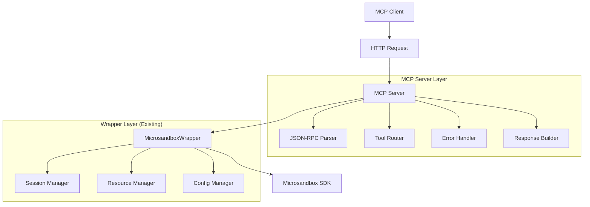
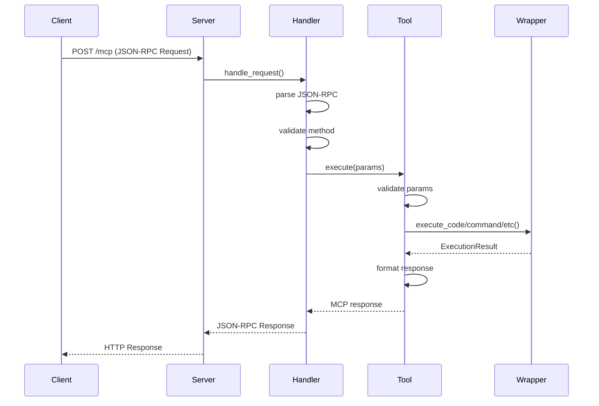
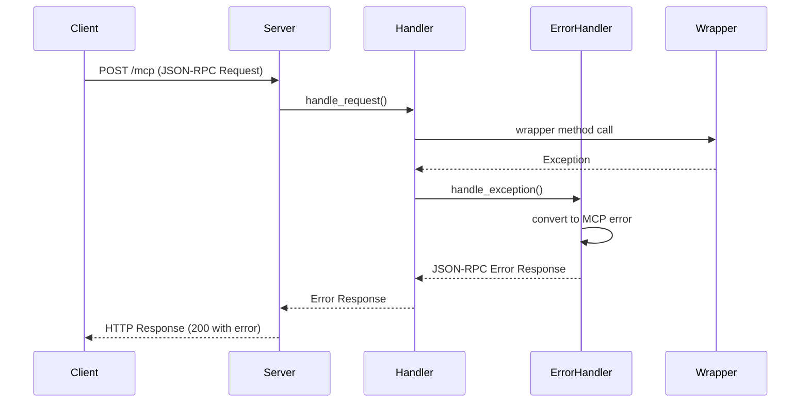

# Design Document

## Overview

本设计文档描述了基于现有 Python MCP wrapper 实现的 HTTP streamable transport 模式 MCP server 的架构和实现细节。该 server 作为一个轻量级的协议适配层，负责处理 MCP 协议消息并将其转换为对 wrapper 的调用。

## Architecture

### Overall Architecture



### Key Architectural Principles

1. **薄协议层**: MCP server 只负责协议转换，不实现业务逻辑
2. **依赖注入**: 通过依赖注入使用现有的 wrapper 实例
3. **生命周期绑定**: MCP server 的生命周期与 wrapper 保持一致
4. **错误转换**: 将 wrapper 异常转换为标准 MCP 错误响应
5. **无状态设计**: server 本身无状态，状态管理由 wrapper 处理

## Core Components

### 1. MCPServer Class

主要的 server 类，负责协调各个组件：

```python
class MCPServer:
    def __init__(
        self,
        wrapper: MicrosandboxWrapper,
        host: str = "localhost",
        port: int = 8775,

        enable_cors: bool = False
    ):
        self.wrapper = wrapper
        self.host = host
        self.port = port

        self.enable_cors = enable_cors
        
        # 初始化组件
        self.tool_registry = ToolRegistry()
        self.error_handler = ErrorHandler()
        self.request_handler = RequestHandler(wrapper, self.tool_registry, self.error_handler)
```

**核心职责:**
- 管理 HTTP 服务器生命周期
- 协调各个组件
- 处理 CORS 配置
- 管理 wrapper 生命周期

### 2. ToolRegistry Class

工具注册和管理：

```python
class ToolRegistry:
    def __init__(self):
        self.tools = {}
        self._register_default_tools()
    
    def _register_default_tools(self):
        """注册默认工具"""
        self.tools = {
            "execute_code": ExecuteCodeTool(),
            "execute_command": ExecuteCommandTool(),
            "get_sessions": GetSessionsTool(),
            "stop_session": StopSessionTool(),
            "get_volume_path": GetVolumePathTool()
        }
    
    def get_tool(self, name: str) -> Optional[Tool]:
        return self.tools.get(name)
    
    def list_tools(self) -> List[ToolDefinition]:
        return [tool.get_definition() for tool in self.tools.values()]
```

**工具定义结构:**
```python
@dataclass
class ToolDefinition:
    name: str
    description: str
    inputSchema: Dict[str, Any]
```

### 3. Tool Classes

每个工具对应一个类，负责参数验证和 wrapper 调用：

```python
class ExecuteCodeTool:
    def get_definition(self) -> ToolDefinition:
        return ToolDefinition(
            name="execute_code",
            description="Execute code in a sandbox with automatic session management",
            inputSchema={
                "type": "object",
                "properties": {
                    "code": {"type": "string", "description": "Code to execute"},
                    "template": {
                        "type": "string", 
                        "description": "Sandbox template",
                        "enum": ["python", "node"],
                        "default": "python"
                    },
                    "session_id": {"type": "string", "description": "Optional session ID"},
                    "flavor": {
                        "type": "string",
                        "enum": ["small", "medium", "large"],
                        "default": "small"
                    }
                },
                "required": ["code"]
            }
        )
    
    async def execute(self, wrapper: MicrosandboxWrapper, params: Dict[str, Any]) -> Dict[str, Any]:
        """执行工具并返回结果"""
        result = await wrapper.execute_code(
            code=params["code"],
            template=params.get("template", "python"),
            session_id=params.get("session_id"),
            flavor=SandboxFlavor(params.get("flavor", "small"))
        )
        
        return {
            "content": [{"type": "text", "text": result.stdout}],
            "isError": not result.success,
            "session_id": result.session_id,
            "execution_time_ms": result.execution_time_ms,
            "session_created": result.session_created
        }
```

### 4. RequestHandler Class

处理 HTTP 请求和 JSON-RPC 消息：

```python
class RequestHandler:
    def __init__(
        self, 
        wrapper: MicrosandboxWrapper, 
        tool_registry: ToolRegistry,
        error_handler: ErrorHandler
    ):
        self.wrapper = wrapper
        self.tool_registry = tool_registry
        self.error_handler = error_handler
    
    async def handle_request(self, request: Request) -> Response:
        """处理 HTTP 请求"""
        if request.method == "POST":
            return await self._handle_jsonrpc_request(request)
        elif request.method == "GET":
            return await self._handle_status_request(request)
        else:
            return Response(status_code=405)
    
    async def _handle_jsonrpc_request(self, request: Request) -> Response:
        """处理 JSON-RPC 请求"""
        try:
            body = await request.json()
            
            # 验证 JSON-RPC 格式
            if not self._is_valid_jsonrpc(body):
                return self._create_error_response(
                    None, -32600, "Invalid Request"
                )
            
            # 路由到对应的处理方法
            if body["method"] == "tools/list":
                return await self._handle_tools_list(body)
            elif body["method"] == "tools/call":
                return await self._handle_tools_call(body)
            else:
                return self._create_error_response(
                    body.get("id"), -32601, "Method not found"
                )
                
        except Exception as e:
            return self.error_handler.handle_exception(e, None)
```

### 5. ErrorHandler Class

统一的错误处理和转换：

```python
class ErrorHandler:
    def handle_exception(self, exc: Exception, request_id: Optional[str]) -> Response:
        """将异常转换为 MCP 错误响应"""
        if isinstance(exc, MicrosandboxWrapperError):
            return self._create_internal_error(request_id, str(exc))
        elif isinstance(exc, ResourceLimitError):
            return self._create_invalid_request_error(request_id, str(exc))
        elif isinstance(exc, ConfigurationError):
            return self._create_internal_error(request_id, str(exc))
        else:
            return self._create_internal_error(request_id, "Internal server error")
    
    def _create_internal_error(self, request_id: Optional[str], message: str) -> Response:
        """创建内部错误响应"""
        return self._create_error_response(request_id, -32603, message)
    
    def _create_invalid_request_error(self, request_id: Optional[str], message: str) -> Response:
        """创建无效请求错误响应"""
        return self._create_error_response(request_id, -32600, message)
    
    def _create_error_response(self, request_id: Optional[str], code: int, message: str) -> Response:
        """创建标准 JSON-RPC 错误响应"""
        error_response = {
            "jsonrpc": "2.0",
            "id": request_id,
            "error": {
                "code": code,
                "message": message
            }
        }
        return Response(
            content=json.dumps(error_response),
            media_type="application/json",
            status_code=200
        )
```

## Data Flow

### Tool Call Flow



### Error Handling Flow



## Configuration

### Environment Variables

```python
@dataclass
class MCPServerConfig:
    host: str = "localhost"
    port: int = 8775

    enable_cors: bool = False
    
    @classmethod
    def from_env(cls) -> 'MCPServerConfig':
        return cls(
            host=os.getenv("MCP_SERVER_HOST", "localhost"),
            port=int(os.getenv("MCP_SERVER_PORT", "8775")),

            enable_cors=os.getenv("MCP_ENABLE_CORS", "false").lower() == "true"
        )
```

### CORS Configuration

当启用 CORS 时，server 应该添加适当的响应头：

```python
def add_cors_headers(response: Response) -> Response:
    """添加 CORS 头"""
    response.headers["Access-Control-Allow-Origin"] = "*"
    response.headers["Access-Control-Allow-Methods"] = "GET, POST, OPTIONS"
    response.headers["Access-Control-Allow-Headers"] = "Content-Type"
    return response
```

## Parameter Handling

### Session ID Parameter

session_id 作为工具参数的一部分，直接透传给 wrapper。MCP server 不管理 session 状态，所有 session 管理由 wrapper 负责：

```python
# session_id 只是作为参数透传
async def execute_tool(self, tool_name: str, params: Dict[str, Any]) -> Dict[str, Any]:
    """执行工具，透传所有参数给 wrapper"""
    tool = self.tool_registry.get_tool(tool_name)
    if not tool:
        raise MethodNotFoundError(f"Tool {tool_name} not found")
    
    # 直接透传参数，包括 session_id
    return await tool.execute(self.wrapper, params)
```

## Lifecycle Management

### Server Startup

```python
async def start_server():
    """启动 MCP server"""
    # 1. 初始化配置
    config = MCPServerConfig.from_env()
    
    # 2. 初始化 wrapper
    wrapper = MicrosandboxWrapper()
    await wrapper.start()
    
    # 3. 初始化 MCP server
    server = MCPServer(wrapper, **config.__dict__)
    
    # 4. 启动 HTTP 服务器
    await server.start()
```

### Server Shutdown

```python
async def shutdown_server(server: MCPServer):
    """优雅关闭 server"""
    # 1. 停止接受新请求
    await server.stop_accepting_requests()
    
    # 2. 等待现有请求完成
    await server.wait_for_requests_completion()
    
    # 3. 关闭 wrapper
    await server.wrapper.stop()
    
    # 4. 关闭 HTTP 服务器
    await server.stop()
```

## Testing Strategy

### Unit Tests
- 测试各个组件的独立功能
- Mock wrapper 进行工具测试
- 测试错误处理转换

### Integration Tests
- 测试完整的请求-响应流程
- 测试与真实 wrapper 的集成
- **注意**: 集成真实 wrapper 做集成测试时使用 `start_msbserver_debug.sh` 脚本启动 msbserver，并使用 `curl -s http://127.0.0.1:5555/api/v1/health` 检查健康状态

### Protocol Compliance Tests
- 验证 JSON-RPC 2.0 协议合规性
- 测试 MCP 协议消息格式
- 验证错误响应格式

## Implementation Notes

### Dependencies

```python
# 核心依赖
fastapi>=0.104.0
uvicorn>=0.24.0
pydantic>=2.0.0

# 现有依赖 (来自 wrapper)
# microsandbox_wrapper 包及其依赖
```

### Project Structure

```
mcp_server/
├── __init__.py
├── server.py          # MCPServer 主类，包含所有核心逻辑
└── main.py           # 入口点和配置管理
```

### Performance Considerations

1. **异步处理**: 所有 I/O 操作使用异步模式
2. **连接池**: 复用 wrapper 的连接池
3. **内存管理**: 及时释放请求相关资源
4. **错误恢复**: 快速失败和恢复机制