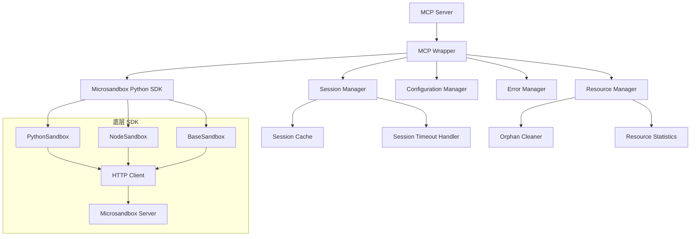

# Design Document

## Overview

本设计文档描述了基于现有 Python SDK 的 MCP 封装接口架构。主要目标是：

1. 提供高级封装接口，简化 MCP Server 开发
2. 自动管理沙箱会话的生命周期
3. 统一资源管理和错误处理
4. 支持异步操作和配置管理
5. 实现孤儿沙箱的自动回收机制

## Project Structure

封装器代码将作为未来 Python MCP Server 的一部分，位于 `mcp-server` 目录下：

```
mcp-server/
├── microsandbox_wrapper/
│   ├── __init__.py
│   ├── wrapper.py          # 主封装接口
│   ├── session_manager.py  # 会话管理
│   ├── resource_manager.py # 资源管理
│   ├── config.py          # 配置管理
│   ├── models.py          # 数据模型
│   ├── exceptions.py      # 异常定义
│   └── logging_config.py  # 日志配置
├── mcp_server.py          # MCP Server 主入口
└── requirements.txt       # 依赖配置
```

## Architecture

### 整体架构



### 核心设计原则

1. **简化接口** - 隐藏底层 SDK 的复杂性，提供直观的 API
2. **自动管理** - 自动处理沙箱生命周期、资源分配和清理
3. **异步优先** - 所有操作都支持 async/await
4. **统一错误处理** - 提供一致的异常类型和错误信息
5. **配置驱动** - 通过环境变量和配置文件进行灵活配置

## Components and Interfaces

### 1. 主要封装接口 (MCP Wrapper)

#### MicrosandboxWrapper 类

```python
class MicrosandboxWrapper:
    """
    Microsandbox 的高级封装接口，为 MCP Server 提供简化的 API
    """
    
    def __init__(
        self,
        server_url: Optional[str] = None,
        api_key: Optional[str] = None,
        config: Optional[WrapperConfig] = None
    ):
        """
        初始化封装器
        
        Args:
            server_url: Microsandbox 服务器地址
            api_key: API 密钥
            config: 配置对象
        """
        
    async def execute_code(
        self,
        code: str,
        template: str = "python",
        session_id: Optional[str] = None,
        flavor: SandboxFlavor = SandboxFlavor.SMALL,
        timeout: Optional[int] = None
    ) -> ExecutionResult:
        """
        执行代码
        
        Args:
            code: 要执行的代码
            template: 沙箱模板 (python, node)
            session_id: 可选的会话ID，如果不提供则创建新会话
            flavor: 沙箱规格 (small, medium, large)
            timeout: 执行超时时间（秒）
            
        Returns:
            ExecutionResult: 执行结果
            
        Raises:
            SandboxCreationError: 沙箱创建失败
            CodeExecutionError: 代码执行失败
            ResourceLimitError: 资源限制错误
        """
        
    async def execute_command(
        self,
        command: str,
        args: Optional[List[str]] = None,
        template: str = "python",
        session_id: Optional[str] = None,
        flavor: SandboxFlavor = SandboxFlavor.SMALL,
        timeout: Optional[int] = None
    ) -> CommandResult:
        """
        执行命令
        
        Args:
            command: 要执行的命令
            args: 命令参数
            template: 沙箱模板 (python, node)
            session_id: 可选的会话ID
            flavor: 沙箱规格
            timeout: 执行超时时间（秒）
            
        Returns:
            CommandResult: 命令执行结果
        """
        
    async def get_sessions(
        self,
        session_id: Optional[str] = None
    ) -> List[SessionInfo]:
        """
        获取会话信息
        
        Args:
            session_id: 可选的特定会话ID
            
        Returns:
            List[SessionInfo]: 会话信息列表
        """
        
    async def stop_session(self, session_id: str) -> bool:
        """
        停止指定会话
        
        Args:
            session_id: 要停止的会话ID
            
        Returns:
            bool: 是否成功停止
        """
        
    async def get_volume_mappings(self) -> List[VolumeMapping]:
        """
        获取共享卷映射信息
        
        Returns:
            List[VolumeMapping]: 卷映射信息列表
        """
        
    async def get_resource_stats(self) -> ResourceStats:
        """
        获取资源使用统计
        
        Returns:
            ResourceStats: 资源统计信息
        """
        
    async def cleanup_orphan_sandboxes(self) -> int:
        """
        清理孤儿沙箱
        
        Returns:
            int: 清理的沙箱数量
        """
```

### 2. 数据模型

#### SandboxFlavor 枚举

```python
from enum import Enum

class SandboxFlavor(Enum):
    """沙箱规格枚举"""
    SMALL = "small"   # 1 CPU, 1GB RAM
    MEDIUM = "medium" # 2 CPU, 2GB RAM
    LARGE = "large"   # 4 CPU, 4GB RAM
    
    def get_memory_mb(self) -> int:
        """获取内存限制（MB）"""
        return {
            self.SMALL: 1024,
            self.MEDIUM: 2048,
            self.LARGE: 4096
        }[self]
        
    def get_cpus(self) -> float:
        """获取CPU限制"""
        return {
            self.SMALL: 1.0,
            self.MEDIUM: 2.0,
            self.LARGE: 4.0
        }[self]
```

#### 执行结果模型

```python
@dataclass
class ExecutionResult:
    """代码执行结果"""
    session_id: str
    stdout: str
    stderr: str
    success: bool
    execution_time_ms: int
    session_created: bool
    template: str
    
@dataclass
class CommandResult:
    """命令执行结果"""
    session_id: str
    stdout: str
    stderr: str
    exit_code: int
    success: bool
    execution_time_ms: int
    session_created: bool
    command: str
    args: List[str]
```

#### 会话信息模型

```python
@dataclass
class SessionInfo:
    """会话信息"""
    session_id: str
    template: str
    flavor: SandboxFlavor
    created_at: datetime
    last_accessed: datetime
    status: SessionStatus
    namespace: str
    sandbox_name: str
    
class SessionStatus(Enum):
    """会话状态"""
    CREATING = "creating"
    READY = "ready"
    RUNNING = "running"
    ERROR = "error"
    STOPPED = "stopped"
```

#### 资源统计模型

```python
@dataclass
class ResourceStats:
    """资源使用统计"""
    active_sessions: int
    max_sessions: int
    sessions_by_flavor: Dict[SandboxFlavor, int]
    total_memory_mb: int
    total_cpus: float
    uptime_seconds: int

@dataclass
class VolumeMapping:
    """卷映射信息"""
    host_path: str
    container_path: str
    
    @classmethod
    def from_string(cls, mapping_str: str) -> 'VolumeMapping':
        """从字符串解析卷映射"""
        parts = mapping_str.split(':', 1)
        if len(parts) != 2:
            raise ValueError(f"Invalid volume mapping format: {mapping_str}")
        return cls(host_path=parts[0], container_path=parts[1])
```

### 3. 会话管理器 (Session Manager)

```python
class SessionManager:
    """会话管理器，负责沙箱会话的生命周期管理"""
    
    def __init__(self, config: WrapperConfig):
        self._sessions: Dict[str, ManagedSession] = {}
        self._config = config
        self._cleanup_task: Optional[asyncio.Task] = None
        
    async def start(self):
        """启动会话管理器"""
        self._cleanup_task = asyncio.create_task(self._cleanup_loop())
        
    async def stop(self):
        """停止会话管理器"""
        if self._cleanup_task:
            self._cleanup_task.cancel()
            
        # 清理所有活跃会话
        for session in list(self._sessions.values()):
            await self._cleanup_session(session)
            
    async def get_or_create_session(
        self,
        session_id: Optional[str],
        template: str,
        flavor: SandboxFlavor
    ) -> ManagedSession:
        """获取或创建会话"""
        
    async def touch_session(self, session_id: str):
        """更新会话访问时间"""
        
    async def stop_session(self, session_id: str) -> bool:
        """停止指定会话"""
        
    async def get_sessions(
        self,
        session_id: Optional[str] = None
    ) -> List[SessionInfo]:
        """获取会话信息"""
        
    async def _cleanup_loop(self):
        """后台清理循环"""
        while True:
            try:
                await asyncio.sleep(self._config.cleanup_interval)
                await self._cleanup_expired_sessions()
            except asyncio.CancelledError:
                break
            except Exception as e:
                logger.error(f"Error in cleanup loop: {e}")
                
    async def _cleanup_expired_sessions(self):
        """清理过期会话"""
```

#### ManagedSession 类

```python
class ManagedSession:
    """托管会话，封装底层沙箱实例"""
    
    def __init__(
        self,
        session_id: str,
        template: str,
        flavor: SandboxFlavor,
        config: WrapperConfig
    ):
        self.session_id = session_id
        self.template = template
        self.flavor = flavor
        self.created_at = datetime.now()
        self.last_accessed = datetime.now()
        self.status = SessionStatus.CREATING
        self.namespace = "default"
        self.sandbox_name = f"session-{session_id[:8]}"
        
        # 底层沙箱实例
        self._sandbox: Optional[BaseSandbox] = None
        self._session: Optional[aiohttp.ClientSession] = None
        self._lock = asyncio.Lock()
        
    async def ensure_started(self):
        """确保沙箱已启动"""
        async with self._lock:
            if self._sandbox is None or not self._sandbox._is_started:
                await self._create_sandbox()
                
    async def execute_code(self, code: str, timeout: Optional[int] = None) -> ExecutionResult:
        """执行代码"""
        await self.ensure_started()
        self.last_accessed = datetime.now()
        self.status = SessionStatus.RUNNING
        
        try:
            start_time = time.time()
            
            # 使用底层 SDK 执行代码
            if timeout:
                result = await asyncio.wait_for(
                    self._sandbox.run(code),
                    timeout=timeout
                )
            else:
                result = await self._sandbox.run(code)
                
            execution_time_ms = int((time.time() - start_time) * 1000)
            
            self.status = SessionStatus.READY
            
            return ExecutionResult(
                session_id=self.session_id,
                stdout=await result.output(),
                stderr=await result.error(),
                success=not result.has_error(),
                execution_time_ms=execution_time_ms,
                session_created=False,
                template=self.template
            )
            
        except asyncio.TimeoutError:
            self.status = SessionStatus.ERROR
            raise CodeExecutionError(f"Code execution timed out after {timeout} seconds")
        except Exception as e:
            self.status = SessionStatus.ERROR
            raise CodeExecutionError(f"Code execution failed: {str(e)}")
            
    async def execute_command(
        self,
        command: str,
        args: Optional[List[str]] = None,
        timeout: Optional[int] = None
    ) -> CommandResult:
        """执行命令"""
        await self.ensure_started()
        self.last_accessed = datetime.now()
        self.status = SessionStatus.RUNNING
        
        try:
            start_time = time.time()
            
            # 使用底层 SDK 执行命令
            if timeout:
                result = await asyncio.wait_for(
                    self._sandbox.command.run(command, args or [], timeout),
                    timeout=timeout + 5  # 给额外的缓冲时间
                )
            else:
                result = await self._sandbox.command.run(command, args or [])
                
            execution_time_ms = int((time.time() - start_time) * 1000)
            
            self.status = SessionStatus.READY
            
            return CommandResult(
                session_id=self.session_id,
                stdout=await result.output(),
                stderr=await result.error(),
                exit_code=result.exit_code,
                success=result.success,
                execution_time_ms=execution_time_ms,
                session_created=False,
                command=command,
                args=args or []
            )
            
        except asyncio.TimeoutError:
            self.status = SessionStatus.ERROR
            raise CommandExecutionError(f"Command execution timed out after {timeout} seconds")
        except Exception as e:
            self.status = SessionStatus.ERROR
            raise CommandExecutionError(f"Command execution failed: {str(e)}")
            
    async def stop(self):
        """停止会话"""
        async with self._lock:
            if self._sandbox and self._sandbox._is_started:
                try:
                    await self._sandbox.stop()
                except Exception as e:
                    logger.error(f"Error stopping sandbox: {e}")
                    
            if self._session:
                try:
                    await self._session.close()
                except Exception as e:
                    logger.error(f"Error closing session: {e}")
                    
            self.status = SessionStatus.STOPPED
            
    async def _create_sandbox(self):
        """创建底层沙箱实例"""
        try:
            # 根据模板选择沙箱类型
            if self.template.lower() in ["python"]:
                from microsandbox import PythonSandbox
                self._sandbox = PythonSandbox(
                    namespace=self.namespace,
                    name=self.sandbox_name
                )
            elif self.template.lower() in ["node"]:
                from microsandbox import NodeSandbox
                self._sandbox = NodeSandbox(
                    namespace=self.namespace,
                    name=self.sandbox_name
                )
            else:
                raise SandboxCreationError(f"Unsupported template: {self.template}")
                
            # 创建 HTTP 会话
            self._session = aiohttp.ClientSession()
            self._sandbox._session = self._session
            
            # 启动沙箱
            volumes = self._config.shared_volume_mappings.copy() if self._config.shared_volume_mappings else []
                
            await self._sandbox.start(
                memory=self.flavor.get_memory_mb(),
                cpus=self.flavor.get_cpus(),
                volumes=volumes,
                timeout=self._config.sandbox_start_timeout
            )
            
            self.status = SessionStatus.READY
            
        except Exception as e:
            self.status = SessionStatus.ERROR
            raise SandboxCreationError(f"Failed to create sandbox: {str(e)}")
```

### 4. 资源管理器 (Resource Manager)

```python
class ResourceManager:
    """资源管理器，负责资源监控和孤儿沙箱清理"""
    
    def __init__(self, config: WrapperConfig, session_manager: SessionManager):
        self._config = config
        self._session_manager = session_manager
        self._orphan_cleanup_task: Optional[asyncio.Task] = None
        
    async def start(self):
        """启动资源管理器"""
        self._orphan_cleanup_task = asyncio.create_task(self._orphan_cleanup_loop())
        
    async def stop(self):
        """停止资源管理器"""
        if self._orphan_cleanup_task:
            self._orphan_cleanup_task.cancel()
            
    async def check_resource_limits(self, flavor: SandboxFlavor) -> bool:
        """检查资源限制"""
        stats = await self.get_resource_stats()
        
        # 检查最大会话数限制
        if stats.active_sessions >= self._config.max_concurrent_sessions:
            return False
            
        # 检查内存限制（如果配置了）
        if self._config.max_total_memory_mb:
            required_memory = stats.total_memory_mb + flavor.get_memory_mb()
            if required_memory > self._config.max_total_memory_mb:
                return False
                
        return True
        
    async def get_resource_stats(self) -> ResourceStats:
        """获取资源使用统计"""
        sessions = await self._session_manager.get_sessions()
        
        active_sessions = len([s for s in sessions if s.status != SessionStatus.STOPPED])
        sessions_by_flavor = {}
        total_memory_mb = 0
        total_cpus = 0.0
        
        for session in sessions:
            if session.status != SessionStatus.STOPPED:
                flavor = session.flavor
                sessions_by_flavor[flavor] = sessions_by_flavor.get(flavor, 0) + 1
                total_memory_mb += flavor.get_memory_mb()
                total_cpus += flavor.get_cpus()
                
        return ResourceStats(
            active_sessions=active_sessions,
            max_sessions=self._config.max_concurrent_sessions,
            sessions_by_flavor=sessions_by_flavor,
            total_memory_mb=total_memory_mb,
            total_cpus=total_cpus,
            uptime_seconds=int(time.time() - self._start_time)
        )
        
    async def cleanup_orphan_sandboxes(self) -> int:
        """清理孤儿沙箱"""
        try:
            # 获取所有运行中的沙箱（这需要调用底层 API）
            running_sandboxes = await self._get_running_sandboxes()
            
            # 获取所有活跃会话
            active_sessions = await self._session_manager.get_sessions()
            active_sandbox_names = {
                f"{s.namespace}/{s.sandbox_name}" 
                for s in active_sessions 
                if s.status != SessionStatus.STOPPED
            }
            
            # 找出孤儿沙箱
            orphan_sandboxes = []
            for sandbox in running_sandboxes:
                sandbox_key = f"{sandbox['namespace']}/{sandbox['name']}"
                if sandbox_key not in active_sandbox_names:
                    orphan_sandboxes.append(sandbox)
                    
            # 清理孤儿沙箱
            cleaned_count = 0
            for orphan in orphan_sandboxes:
                try:
                    await self._stop_orphan_sandbox(orphan)
                    cleaned_count += 1
                    logger.info(f"Cleaned orphan sandbox: {orphan['namespace']}/{orphan['name']}")
                except Exception as e:
                    logger.error(f"Failed to clean orphan sandbox {orphan['name']}: {e}")
                    
            return cleaned_count
            
        except Exception as e:
            logger.error(f"Error during orphan cleanup: {e}")
            return 0
            
    async def _orphan_cleanup_loop(self):
        """孤儿沙箱清理循环"""
        while True:
            try:
                await asyncio.sleep(self._config.orphan_cleanup_interval)
                cleaned = await self.cleanup_orphan_sandboxes()
                if cleaned > 0:
                    logger.info(f"Cleaned {cleaned} orphan sandboxes")
            except asyncio.CancelledError:
                break
            except Exception as e:
                logger.error(f"Error in orphan cleanup loop: {e}")
                
    async def _get_running_sandboxes(self) -> List[Dict[str, str]]:
        """获取所有运行中的沙箱（需要调用底层 API）"""
        # 这里需要调用 microsandbox server 的 API 来获取所有运行中的沙箱
        # 具体实现取决于 server 是否提供这样的 API
        # 暂时返回空列表，实际实现时需要根据 server API 来完成
        return []
        
    async def _stop_orphan_sandbox(self, sandbox_info: Dict[str, str]):
        """停止孤儿沙箱"""
        # 创建临时沙箱实例来停止孤儿沙箱
        from microsandbox import PythonSandbox
        
        temp_sandbox = PythonSandbox(
            namespace=sandbox_info['namespace'],
            name=sandbox_info['name']
        )
        
        temp_session = aiohttp.ClientSession()
        temp_sandbox._session = temp_session
        temp_sandbox._is_started = True  # 假设它已经启动
        
        try:
            await temp_sandbox.stop()
        finally:
            await temp_session.close()
```

### 5. 配置管理器 (Configuration Manager)

```python
from dataclasses import dataclass, field

@dataclass
class WrapperConfig:
    """封装器配置"""
    # 服务器配置
    server_url: str = "http://127.0.0.1:5555"
    api_key: Optional[str] = None
    
    # 会话配置
    session_timeout: int = 1800  # 30分钟
    max_concurrent_sessions: int = 10
    cleanup_interval: int = 60  # 1分钟
    
    # 沙箱配置
    default_flavor: SandboxFlavor = SandboxFlavor.SMALL
    sandbox_start_timeout: float = 180.0
    default_execution_timeout: int = 300  # 5分钟
    
    # 资源配置
    max_total_memory_mb: Optional[int] = None
    shared_volume_mappings: List[str] = field(default_factory=list)  # ["localdir1:sandboxdir1", "localdir2:sandboxdir2"]
    
    # 孤儿清理配置
    orphan_cleanup_interval: int = 600  # 10分钟
    
    @classmethod
    def from_env(cls) -> 'WrapperConfig':
        """从环境变量创建配置"""
        # 解析共享卷映射
        shared_volume_mappings = []
        volume_path_env = os.getenv('MSB_SHARED_VOLUME_PATH')
        if volume_path_env:
            try:
                import json
                # 尝试解析为 JSON 数组
                shared_volume_mappings = json.loads(volume_path_env)
                if not isinstance(shared_volume_mappings, list):
                    raise ValueError("MSB_SHARED_VOLUME_PATH must be a JSON array")
            except (json.JSONDecodeError, ValueError) as e:
                # 如果不是有效的 JSON，尝试按逗号分割
                shared_volume_mappings = [mapping.strip() for mapping in volume_path_env.split(',') if mapping.strip()]
        
        return cls(
            server_url=os.getenv('MSB_SERVER_URL', 'http://127.0.0.1:5555'),
            api_key=os.getenv('MSB_API_KEY'),
            session_timeout=int(os.getenv('MSB_SESSION_TIMEOUT', '1800')),
            max_concurrent_sessions=int(os.getenv('MSB_MAX_SESSIONS', '10')),
            cleanup_interval=int(os.getenv('MSB_CLEANUP_INTERVAL', '60')),
            default_flavor=SandboxFlavor(os.getenv('MSB_DEFAULT_FLAVOR', 'small')),
            sandbox_start_timeout=float(os.getenv('MSB_SANDBOX_START_TIMEOUT', '180.0')),
            default_execution_timeout=int(os.getenv('MSB_EXECUTION_TIMEOUT', '300')),
            max_total_memory_mb=int(os.getenv('MSB_MAX_TOTAL_MEMORY_MB')) if os.getenv('MSB_MAX_TOTAL_MEMORY_MB') else None,
            shared_volume_mappings=shared_volume_mappings,
            orphan_cleanup_interval=int(os.getenv('MSB_ORPHAN_CLEANUP_INTERVAL', '600'))
        )
```

## Error Handling

### 异常类型定义

```python
class MicrosandboxWrapperError(Exception):
    """封装器基础异常"""
    pass

class SandboxCreationError(MicrosandboxWrapperError):
    """沙箱创建失败异常"""
    pass

class CodeExecutionError(MicrosandboxWrapperError):
    """代码执行失败异常"""
    pass

class CommandExecutionError(MicrosandboxWrapperError):
    """命令执行失败异常"""
    pass

class ResourceLimitError(MicrosandboxWrapperError):
    """资源限制异常"""
    pass

class SessionNotFoundError(MicrosandboxWrapperError):
    """会话未找到异常"""
    pass

class ConfigurationError(MicrosandboxWrapperError):
    """配置错误异常"""
    pass

class ConnectionError(MicrosandboxWrapperError):
    """连接错误异常"""
    pass
```

### 错误处理策略

1. **自动重试** - 对于网络错误和临时性错误，实现指数退避重试
2. **优雅降级** - 当资源不足时，建议使用更小的 flavor
3. **详细日志** - 记录所有错误的详细上下文信息
4. **用户友好** - 提供清晰的错误信息和解决建议

## Testing Strategy

### 单元测试

1. **MicrosandboxWrapper 测试**
   - 代码执行功能
   - 命令执行功能
   - 会话管理功能
   - 错误处理

2. **SessionManager 测试**
   - 会话创建和管理
   - 超时清理机制
   - 并发安全性

3. **ResourceManager 测试**
   - 资源统计
   - 孤儿沙箱检测和清理
   - 资源限制检查

4. **配置管理测试**
   - 环境变量解析
   - 默认值处理
   - 配置验证

### 集成测试

1. **端到端测试**
   - 完整的代码执行流程
   - 会话生命周期管理
   - 资源清理验证
   - **注意**: 端到端测试时使用 `start_msbserver_debug.sh` 脚本启动 msbserver，并使用curl -s http://127.0.0.1:5555/api/v1/health 检查

2. **基本功能测试**
   - 多会话顺序执行
   - 会话切换和复用
   - 基本功能验证

3. **错误场景测试**
   - 网络中断恢复
   - 沙箱崩溃处理
   - 资源耗尽场景

### 性能测试

1. **基本性能测试**
   - 代码执行响应时间
   - 会话创建时间
   - 资源清理效率
   - 内存使用监控

## Implementation Phases

### Phase 1: 核心封装接口
- 实现 MicrosandboxWrapper 主类
- 基本的代码和命令执行功能
- 简单的会话管理

### Phase 2: 高级会话管理
- 完整的 SessionManager 实现
- 自动超时清理
- 会话状态跟踪

### Phase 3: 资源管理和监控
- ResourceManager 实现
- 孤儿沙箱清理
- 资源使用统计

### Phase 4: 配置和错误处理
- 完整的配置管理
- 统一的错误处理
- 日志和监控

### Phase 5: 测试和集成
- 单元测试和集成测试
- MCP Server 集成
- 文档和使用示例