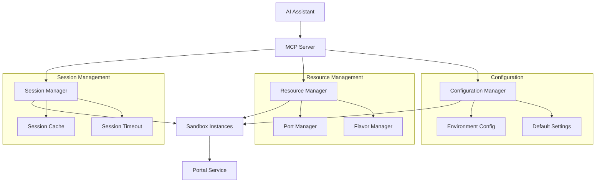

# Design Document

## Overview

本设计文档描述了简化MCP Server接口的架构和实现方案。主要目标是：

1. 简化AI调用沙箱的复杂度，提供更直观的工具接口
2. 实现自动按需沙箱创建和session管理
3. 通过预设规格和环境变量配置减少参数复杂性
4. 提供更好的资源管理和错误处理

## Architecture

### 整体架构



### 核心组件

1. **简化的MCP工具接口** - 提供`execute_code`、`execute_command`等主要工具
2. **Session Manager** - 管理沙箱session的生命周期和状态
3. **Resource Manager** - 管理沙箱资源分配和清理
4. **Configuration Manager** - 处理预设规格和环境变量配置

## Components and Interfaces

### 1. 简化的MCP工具接口

#### execute_code 工具

```json
{
  "name": "execute_code",
  "description": "在沙箱中执行代码，支持自动创建和session管理",
  "inputSchema": {
    "type": "object",
    "properties": {
      "code": {
        "type": "string",
        "description": "要执行的代码"
      },
      "language": {
        "type": "string",
        "description": "编程语言",
        "enum": ["python", "javascript", "node"]
      },
      "session_id": {
        "type": "string",
        "description": "可选的session ID，如果不提供则创建新session"
      },
      "flavor": {
        "type": "string",
        "description": "沙箱规格",
        "enum": ["small", "medium", "large"],
        "default": "small"
      }
    },
    "required": ["code", "language"]
  }
}
```

#### execute_command 工具

```json
{
  "name": "execute_command",
  "description": "在沙箱中执行shell命令",
  "inputSchema": {
    "type": "object",
    "properties": {
      "command": {
        "type": "string",
        "description": "要执行的命令"
      },
      "args": {
        "type": "array",
        "items": {"type": "string"},
        "description": "命令参数"
      },
      "session_id": {
        "type": "string",
        "description": "可选的session ID，如果不提供则创建新session"
      },
      "flavor": {
        "type": "string",
        "description": "沙箱规格",
        "enum": ["small", "medium", "large"],
        "default": "small"
      }
    },
    "required": ["command"]
  }
}
```

#### get_sessions 工具

```json
{
  "name": "get_sessions",
  "description": "获取当前活跃的session列表",
  "inputSchema": {
    "type": "object",
    "properties": {
      "session_id": {
        "type": "string",
        "description": "可选的特定session ID"
      }
    }
  }
}
```

#### stop_session 工具

```json
{
  "name": "stop_session",
  "description": "停止指定的session",
  "inputSchema": {
    "type": "object",
    "properties": {
      "session_id": {
        "type": "string",
        "description": "要停止的session ID"
      }
    },
    "required": ["session_id"]
  }
}
```

#### get_volume_path 工具

```json
{
  "name": "get_volume_path",
  "description": "获取沙箱内共享卷的路径，用于访问与用户环境共享的文件",
  "inputSchema": {
    "type": "object",
    "properties": {
      "session_id": {
        "type": "string",
        "description": "可选的session ID，如果不提供则返回默认路径"
      }
    }
  }
}
```

### 2. Session Manager

#### SessionManager 结构

```rust
pub struct SessionManager {
    sessions: Arc<RwLock<HashMap<String, SessionInfo>>>,
    timeout_duration: Duration,
    cleanup_interval: Duration,
}

pub struct SessionInfo {
    pub id: String,
    pub namespace: String,
    pub sandbox_name: String,
    pub language: String,
    pub flavor: SandboxFlavor,
    pub created_at: Instant,
    pub last_accessed: Instant,
    pub status: SessionStatus,
}

pub enum SessionStatus {
    Creating,
    Ready,
    Running,
    Error(String),
    Stopped,
}
```

#### 核心方法

```rust
impl SessionManager {
    // 创建新session
    pub async fn create_session(
        &self,
        language: &str,
        flavor: SandboxFlavor,
    ) -> Result<String, SessionError>;
    
    // 获取或创建session
    pub async fn get_or_create_session(
        &self,
        session_id: Option<String>,
        language: &str,
        flavor: SandboxFlavor,
    ) -> Result<SessionInfo, SessionError>;
    
    // 更新session访问时间
    pub async fn touch_session(&self, session_id: &str) -> Result<(), SessionError>;
    
    // 停止session
    pub async fn stop_session(&self, session_id: &str) -> Result<(), SessionError>;
    
    // 清理过期session
    pub async fn cleanup_expired_sessions(&self) -> Result<Vec<String>, SessionError>;
    
    // 获取共享卷路径
    pub fn get_volume_path(&self) -> Option<String>;
}
```

### 3. Resource Manager

#### SandboxFlavor 定义

```rust
#[derive(Debug, Clone, Copy, PartialEq, Eq)]
pub enum SandboxFlavor {
    Small,  // 1 CPU, 1GB RAM
    Medium, // 2 CPU, 2GB RAM
    Large,  // 4 CPU, 4GB RAM
}

impl SandboxFlavor {
    pub fn get_memory_mb(&self) -> u32 {
        match self {
            Self::Small => 1024,
            Self::Medium => 2048,
            Self::Large => 4096,
        }
    }
    
    pub fn get_cpus(&self) -> u8 {
        match self {
            Self::Small => 1,
            Self::Medium => 2,
            Self::Large => 4,
        }
    }
}
```

#### ResourceManager 结构

```rust
pub struct ResourceManager {
    port_manager: Arc<RwLock<PortManager>>,
    active_sessions: Arc<RwLock<HashMap<String, ResourceAllocation>>>,
    max_concurrent_sessions: usize,
}

pub struct ResourceAllocation {
    pub session_id: String,
    pub flavor: SandboxFlavor,
    pub port: u16,
    pub allocated_at: Instant,
}
```

### 4. Configuration Manager

#### 环境变量配置

```rust
pub struct ConfigurationManager {
    shared_volume_path: Option<PathBuf>,
    shared_volume_guest_path: String,
    default_flavor: SandboxFlavor,
    session_timeout: Duration,
    max_sessions: usize,
}

impl ConfigurationManager {
    pub fn from_env() -> Self {
        Self {
            shared_volume_path: env::var("MSB_SHARED_VOLUME_PATH")
                .ok()
                .map(PathBuf::from),
            shared_volume_guest_path: env::var("MSB_SHARED_VOLUME_GUEST_PATH")
                .unwrap_or_else(|| "/shared".to_string()),
            default_flavor: env::var("MSB_DEFAULT_FLAVOR")
                .ok()
                .and_then(|s| s.parse().ok())
                .unwrap_or(SandboxFlavor::Small),
            session_timeout: Duration::from_secs(
                env::var("MSB_SESSION_TIMEOUT_SECONDS")
                    .ok()
                    .and_then(|s| s.parse().ok())
                    .unwrap_or(1800) // 30分钟默认
            ),
            max_sessions: env::var("MSB_MAX_SESSIONS")
                .ok()
                .and_then(|s| s.parse().ok())
                .unwrap_or(10),
        }
    }
    
    pub fn get_shared_volume_guest_path(&self) -> &str {
        &self.shared_volume_guest_path
    }
}
```

## Data Models

### 请求和响应模型

#### ExecuteCodeRequest

```rust
#[derive(Debug, Deserialize)]
pub struct ExecuteCodeRequest {
    pub code: String,
    pub language: String,
    pub session_id: Option<String>,
    pub flavor: Option<SandboxFlavor>,
}
```

#### ExecuteCommandRequest

```rust
#[derive(Debug, Deserialize)]
pub struct ExecuteCommandRequest {
    pub command: String,
    pub args: Option<Vec<String>>,
    pub session_id: Option<String>,
    pub flavor: Option<SandboxFlavor>,
}
```

#### ExecutionResponse

```rust
#[derive(Debug, Serialize)]
pub struct ExecutionResponse {
    pub session_id: String,
    pub stdout: String,
    pub stderr: String,
    pub exit_code: Option<i32>,
    pub execution_time_ms: u64,
    pub session_created: bool,
}
```

#### SessionListResponse

```rust
#[derive(Debug, Serialize)]
pub struct SessionListResponse {
    pub sessions: Vec<SessionSummary>,
}

#[derive(Debug, Serialize)]
pub struct SessionSummary {
    pub id: String,
    pub language: String,
    pub flavor: String,
    pub status: String,
    pub created_at: String,
    pub last_accessed: String,
    pub uptime_seconds: u64,
}
```

#### VolumePathResponse

```rust
#[derive(Debug, Serialize)]
pub struct VolumePathResponse {
    pub volume_path: String,
    pub description: String,
    pub available: bool,
}
```

### 内部数据模型

#### 语言到镜像映射

```rust
pub struct LanguageMapping {
    mappings: HashMap<String, String>,
}

impl Default for LanguageMapping {
    fn default() -> Self {
        let mut mappings = HashMap::new();
        mappings.insert("python".to_string(), "microsandbox/python".to_string());
        mappings.insert("javascript".to_string(), "microsandbox/node".to_string());
        mappings.insert("node".to_string(), "microsandbox/node".to_string());
        
        Self { mappings }
    }
}
```

## Error Handling

### 错误类型定义

```rust
#[derive(Debug, thiserror::Error)]
pub enum SimplifiedMcpError {
    #[error("Session not found: {0}")]
    SessionNotFound(String),
    
    #[error("Session creation failed: {0}")]
    SessionCreationFailed(String),
    
    #[error("Unsupported language: {0}")]
    UnsupportedLanguage(String),
    
    #[error("Resource limit exceeded: {0}")]
    ResourceLimitExceeded(String),
    
    #[error("Execution timeout: {0}")]
    ExecutionTimeout(String),
    
    #[error("Invalid session state: {0}")]
    InvalidSessionState(String),
    
    #[error("Configuration error: {0}")]
    ConfigurationError(String),
    
    #[error("Internal error: {0}")]
    InternalError(String),
}
```

### 错误处理策略

1. **Session错误** - 提供创建新session的建议
2. **资源限制错误** - 提供等待或使用更小规格的建议
3. **执行超时** - 提供优化代码或增加超时时间的建议
4. **配置错误** - 提供具体的配置修复指导

## Testing Strategy

### 单元测试

1. **SessionManager测试**
   - Session创建和管理
   - 超时清理机制
   - 并发访问安全性

2. **ResourceManager测试**
   - 资源分配和释放
   - 端口管理
   - 规格配置

3. **ConfigurationManager测试**
   - 环境变量解析
   - 默认值处理
   - 配置验证

### 集成测试

1. **MCP工具接口测试**
   - 代码执行流程
   - 命令执行流程
   - Session管理流程

2. **端到端测试**
   - AI助手调用场景
   - 多session并发场景
   - 资源清理场景

### 性能测试

1. **基本功能测试**
   - Session超时清理
   - 基本响应时间验证

## Implementation Phases

### Phase 1: 核心Session管理
- 实现SessionManager基础功能
- 实现简化的MCP工具接口
- 基本的资源管理

### Phase 2: 高级功能
- 自动清理机制
- 环境变量配置支持
- 改进的错误处理

### Phase 3: 优化和监控
- 性能优化
- 监控和日志
- 文档和示例