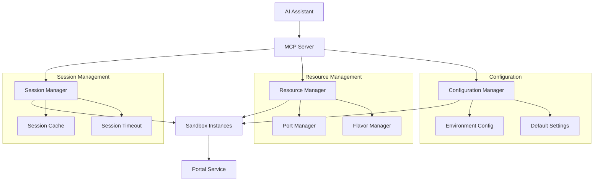
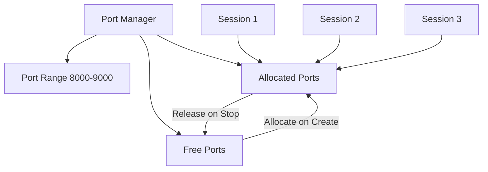
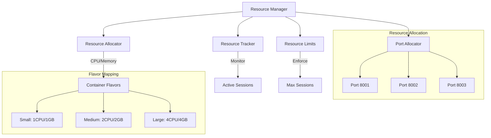

# Simplified MCP Design Document

## Introduction

This design document describes the architecture and implementation details of the simplified Model Context Protocol (MCP) interface for the microsandbox server. The goal is to provide an intuitive and streamlined interface for executing code within sandbox environments with automatic session management and predefined resource configurations.

## Architecture

### Overall Architecture



### Key Architectural Principles

1. **Simplified Interface**: The MCP interface abstracts complex sandbox configuration into simple, predefined "flavors" (small, medium, large)
2. **Automatic Session Management**: Sessions are created on-demand and cleaned up automatically based on timeout policies
3. **Resource Isolation**: Each session gets its own allocated resources (CPU, memory, ports) to prevent interference
4. **Integration with Existing Infrastructure**: Seamlessly integrates with the existing `sandbox_start_impl` functionality and orchestration layer

### Integration Points

- **sandbox_start_impl**: Used for creating actual sandbox containers with generated configurations
- **Portal Service**: Provides execution environment for code and command execution
- **Orchestration Layer**: Manages sandbox lifecycle and resource allocation
- **Configuration System**: Handles environment-specific settings via environment variables

## Core Components

### 1. SandboxFlavor Enum

Predefined sandbox resource configurations that abstract away complex resource allocation:

```python
class SandboxFlavor(Enum):
    SMALL = "small"   # 1 CPU, 1GB RAM - Basic tasks, simple scripts
    MEDIUM = "medium" # 2 CPUs, 2GB RAM - Data processing, moderate workloads
    LARGE = "large"   # 4 CPUs, 4GB RAM - Intensive computation, large datasets
```

**Usage Examples:**
- `SMALL`: Simple Python scripts, basic shell commands, learning exercises
- `MEDIUM`: Data analysis with pandas, web scraping, moderate compilation tasks
- `LARGE`: Machine learning training, large dataset processing, complex builds

**Resource Mapping:**
- Memory limits are enforced at the container level
- CPU limits use Docker's CPU quota system
- Each flavor maps to specific container resource constraints

### 2. Error Handling System

Comprehensive error classification with user-friendly messages and recovery suggestions:

```python
class SimplifiedMcpError(Exception):
    def get_user_friendly_message(self) -> UserFriendlyError:
        # Returns structured error information with:
        # - error_type: Programmatic identifier
        # - message: Human-readable description
        # - suggestions: List of resolution steps
        # - recovery_actions: Automated recovery options
```

**Error Categories:**
- **SessionNotFound**: Session expired or invalid ID
- **ResourceLimitExceeded**: System capacity reached
- **CompilationError**: Code syntax or compilation issues
- **RuntimeError**: Execution-time failures
- **SystemError**: Infrastructure or permission issues

**Recovery Actions:**
- Automatic session creation for expired sessions
- Resource flavor downgrade suggestions
- Retry mechanisms with backoff

### 3. Session Management

Automatic lifecycle management with status tracking and cleanup:

```python
class SessionStatus(Enum):
    CREATING = "creating"  # Sandbox being initialized
    READY = "ready"        # Available for execution
    RUNNING = "running"    # Currently executing code/commands
    ERROR = "error"        # Failed state with error message
    STOPPED = "stopped"    # Manually or automatically stopped
```

**Session Features:**
- UUID-based session identifiers
- Automatic timeout management (default: 30 minutes)
- Resource cleanup on expiration
- Status persistence and tracking
- Background cleanup tasks

**Session Information Structure:**
```python
class SessionInfo:
    id: str                    # Unique session identifier
    namespace: str             # namespace
    sandbox_name: str          # sandbox name
    language: str              # Template (python, node)
    flavor: SandboxFlavor      # Resource configuration
    created_at: datetime       # Creation timestamp
    last_accessed: datetime    # Last activity time
    status: SessionStatus      # Current state
```

### 4. Resource Management

Efficient allocation and monitoring of system resources:

**Port Manager:**
- Allocates unique ports from configurable range (default: 8000-9000)
- Prevents port conflicts between sessions
- Automatic port cleanup on session termination

**Resource Manager:**
- Tracks active resource allocations per session
- Enforces concurrent session limits
- Monitors memory and CPU usage by flavor
- Provides resource usage statistics

**Resource Allocation Structure:**
```python
class ResourceAllocation:
    session_id: str           # Associated session
    flavor: SandboxFlavor     # Resource configuration
    port: int                 # Allocated port number
    allocated_at: datetime    # Allocation timestamp
```

**Configuration Manager:**
Handles environment-based configuration:

```python
# Environment Variables:
# MSB_SHARED_VOLUME_PATH - Host path for shared volume
# MSB_DEFAULT_FLAVOR - Default resource flavor
# MSB_SESSION_TIMEOUT_SECONDS - Session timeout
# MSB_MAX_SESSIONS - Maximum concurrent sessions
```

## Tool Interfaces

### 1. execute_code Tool

Executes code within a sandbox environment with automatic session management.

**Input Schema:**
```json
{
  "name": "execute_code",
  "description": "Execute code in a sandbox with automatic session management",
  "inputSchema": {
    "type": "object",
    "properties": {
      "code": {
        "type": "string",
        "description": "Code to execute"
      },
      "template": {
        "type": "string",
        "description": "Sandbox template/image to use",
        "enum": ["python", "node"]
      },
      "session_id": {
        "type": "string",
        "description": "Optional session ID - if not provided, creates new session"
      },
      "flavor": {
        "type": "string",
        "description": "Sandbox resource flavor",
        "enum": ["small", "medium", "large"],
        "default": "small"
      }
    },
    "required": ["code"]
  }
}
```

**Example Usage:**
```python
# Simple Python execution
request = {
    "code": "print('Hello, World!')\nprint(2 + 2)",
    "template": "python"
}

# Node.js execution with specific session
request = {
    "code": "console.log('Node.js execution');",
    "template": "node",
    "session_id": "session-abc123",
    "flavor": "medium"
}
```

**Response Structure:**
```python
class ExecutionResponse:
    session_id: str          # Session used for execution
    stdout: str              # Standard output
    stderr: str              # Standard error
    exit_code: Optional[int] # Exit code (None for successful code execution)
    execution_time_ms: int   # Execution duration in milliseconds
    session_created: bool    # Whether a new session was created
```

### 2. execute_command Tool

Executes shell commands in isolated sandbox sessions.

**Input Schema:**
```json
{
  "name": "execute_command",
  "description": "Execute shell commands in a sandbox",
  "inputSchema": {
    "type": "object",
    "properties": {
      "command": {
        "type": "string",
        "description": "Command to execute"
      },
      "args": {
        "type": "array",
        "items": {"type": "string"},
        "description": "Command arguments"
      },
      "template": {
        "type": "string",
        "description": "Sandbox template",
        "enum": ["python", "node"]
      },
      "session_id": {
        "type": "string",
        "description": "Optional session ID"
      },
      "flavor": {
        "type": "string",
        "enum": ["small", "medium", "large"]
      }
    },
    "required": ["command"]
  }
}
```

**Example Usage:**
```python
# List directory contents
request = {
    "command": "ls",
    "args": ["-la", "/tmp"]
}

# Check Python version in specific session
request = {
    "command": "python",
    "args": ["--version"],
    "template": "python",
    "session_id": "session-python-123"
}
```

### 3. get_sessions Tool

Retrieves information about active sandbox sessions.

**Input Schema:**
```json
{
  "name": "get_sessions",
  "description": "Get list of active sandbox sessions",
  "inputSchema": {
    "type": "object",
    "properties": {
      "session_id": {
        "type": "string",
        "description": "Optional specific session ID to query"
      }
    }
  }
}
```

**Response Structure:**
```python
class SessionListResponse:
    sessions: List[SessionSummary]

class SessionSummary:
    id: str                  # Session identifier
    language: str            # Programming language/environment
    flavor: str              # Resource flavor
    status: str              # Current status
    created_at: str          # Creation timestamp (ISO 8601)
    last_accessed: str       # Last access timestamp
    uptime_seconds: int      # Session uptime
```

### 4. stop_session Tool

Stops a specific sandbox session and releases its resources.

**Input Schema:**
```json
{
  "name": "stop_session",
  "description": "Stop a specific sandbox session",
  "inputSchema": {
    "type": "object",
    "properties": {
      "session_id": {
        "type": "string",
        "description": "Session ID to stop"
      }
    },
    "required": ["session_id"]
  }
}
```

**Example Usage:**
```python
request = {
    "session_id": "session-abc123"
}
```

**Response Structure:**
```python
class StopSessionResponse:
    session_id: str          # Session that was stopped
    success: bool            # Whether stop was successful
    message: Optional[str]   # Status message
```

### 5. get_volume_path Tool

Provides information about shared volume paths for file access.

**Input Schema:**
```json
{
  "name": "get_volume_path",
  "description": "Get shared volume path information",
  "inputSchema": {
    "type": "object",
    "properties": {
      "session_id": {
        "type": "string",
        "description": "Optional session ID"
      }
    }
  }
}
```

**Response Structure:**
```python
class VolumePathResponse:
    volume_path: str         # Path inside sandbox (/shared)
    description: str         # Description of volume usage
    available: bool          # Whether volume is configured and available
```

**Example Response:**
```python
{
    "volume_path": "/shared",
    "description": "Shared volume mounted at /shared (host: /Users/user/shared)",
    "available": True
}
```

## Session Lifecycle (Expanded)

1. **Creation**:
   - Sessions are automatically created when tools are invoked without an existing session ID.
   - **Example Use Case**: A developer starts a new data analysis task without specifying a session, leading to the creation of a new session with default settings.

2. **Status Management**:
   - Sessions can transition through multiple states: Creating, Ready, Running, Error, Stopped.
   - **Example Use Case**: During a machine learning training session, the session transitions from Ready to Running, and upon completion or error, to the final state.

3. **Timeout and Cleanup**:
   - Sessions automatically timeout after a period of inactivity (default is 30 minutes).
   - **Example Use Case**: A session started for compiling a large project remains active as long as the build process runs. It times out automatically when idle.

4. **Flow Diagram**:
   - Flow diagrams illustrate transitions between session states, capturing key events like execution start, failure, and user-initiated stop commands.

## Resource Management

### Resource Allocation Strategy

The resource management system is designed around three core principles:
1. **Predictable Resource Usage**: Each SandboxFlavor provides known resource constraints
2. **Isolation**: Sessions cannot interfere with each other's resources
3. **Automatic Cleanup**: Resources are automatically freed when sessions expire

### Port Management



**Port Allocation Logic:**
```python
class PortManager:
    def __init__(self, start_port=8000, end_port=9000):
        self.port_range = range(start_port, end_port)
        self.allocated_ports = set()
        self.next_port = start_port
    
    def allocate_port(self) -> int:
        # Round-robin allocation with conflict detection
        # Returns first available port in range
        # Raises ResourceLimitExceeded if no ports available
        
    def release_port(self, port: int):
        # Frees port for reuse
        # Validates port is in managed range
```

### Resource Manager Architecture



### Resource Allocation Workflow

1. **Session Request**: Tool invocation triggers resource allocation
2. **Availability Check**: Verify system capacity and limits
3. **Port Allocation**: Assign unique port from available pool
4. **Resource Reservation**: Reserve CPU/memory based on flavor
5. **Tracking**: Record allocation with timestamp
6. **Cleanup**: Automatic release on session timeout/stop

### Resource Statistics and Monitoring

```python
class ResourceStats:
    active_sessions: int           # Currently running sessions
    max_sessions: int             # System limit
    allocated_ports: int          # Ports in use
    available_ports: int          # Ports available
    total_memory_mb: int          # Memory allocated across all sessions
    total_cpus: int               # CPU cores allocated
    flavor_counts: Dict[SandboxFlavor, int]  # Sessions by flavor
    
    # Resource utilization percentages
    @property
    def session_utilization(self) -> float:
        return (self.active_sessions / self.max_sessions) * 100
    
    @property
    def port_utilization(self) -> float:
        total_ports = self.allocated_ports + self.available_ports
        return (self.allocated_ports / total_ports) * 100
```

### Background Cleanup Tasks

**Session Cleanup Task:**
- Runs every 60 seconds
- Identifies expired sessions based on last_accessed time
- Gracefully stops sandbox containers
- Releases allocated resources (ports, memory)

**Resource Cleanup Task:**
- Runs every 5 minutes
- Identifies orphaned resource allocations
- Handles cleanup failures gracefully
- Prevents resource leaks

**Orphan Sandbox Detection and Cleanup:**
- Runs every 10 minutes
- Detects sandboxes without corresponding session mappings
- Cross-references running sandboxes with active session registry
- Automatically terminates and cleans up orphaned sandboxes
- Logs orphan detection events for monitoring and debugging

### Resource Limits and Throttling

```python
# Configuration-based limits
MAX_CONCURRENT_SESSIONS = 10      # Total active sessions
MAX_MEMORY_PER_FLAVOR = {
    'small': 1024,   # 1GB
    'medium': 2048,  # 2GB
    'large': 4096    # 4GB
}
MAX_CPU_PER_FLAVOR = {
    'small': 1,
    'medium': 2,
    'large': 4
}

# System-level protections
MAX_MEMORY_PER_SESSION = 8192     # 8GB hard limit
MAX_CPUS_PER_SESSION = 8          # 8 CPU hard limit
```

### Error Handling in Resource Management

**Resource Exhaustion:**
- Port pool exhausted → Suggest stopping unused sessions
- Memory limit reached → Recommend smaller flavors
- CPU limit reached → Queue requests or suggest retry

**Recovery Strategies:**
- Automatic retry with exponential backoff
- Graceful degradation to smaller flavors
- Resource waitlists for high-demand periods

## Data Models

### ExecuteCodeRequest

```python
@dataclass
class ExecuteCodeRequest:
    code: str                     # Code to be executed
    template: Optional[str]       # 'python', 'node', etc.
    session_id: Optional[str]     # Existing session ID or None
    flavor: Optional[SandboxFlavor]  # e.g., 'small', 'medium'
```

**Usage Example:**
```python
request = ExecuteCodeRequest(code="print('Hello, World!')", template="python")
```

### ExecuteCommandRequest

```python
@dataclass
class ExecuteCommandRequest:
    command: str                  # Command to execute
    args: Optional[List[str]]     # Arguments list for the command
    template: Optional[str]       # Template 
    session_id: Optional[str]     # Session ID
    flavor: Optional[SandboxFlavor]  # Resource flavor
```

**Usage Example:**
```python
request = ExecuteCommandRequest(command="ls", args=["-la", "/tmp"])
```

### SessionListResponse

```python
@dataclass
class SessionListResponse:
    sessions: List[SessionSummary]

@dataclass
class SessionSummary:
    id: str
    language: str
    flavor: SandboxFlavor
    status: SessionStatus
    created_at: str
    last_accessed: str
    uptime_seconds: int
```

**Example Scenario:**
- Retrieve list of sessions for monitoring active workloads.
- Inspect session details to understand runtime, resource usage, etc.

### ExecutionResponse

```python
@dataclass
class ExecutionResponse:
    session_id: str
    stdout: str
    stderr: str
    exit_code: Optional[int]
    execution_time_ms: int
    session_created: bool
```

**Usage Example:**
```python
response = ExecutionResponse(session_id="session-123", stdout="Output", stderr="", exit_code=0, execution_time_ms=100, session_created=True)
```

### StopSessionResponse

```python
@dataclass
class StopSessionResponse:
    session_id: str
    success: bool
    message: Optional[str]
```

### VolumePathResponse

```python
@dataclass
class VolumePathResponse:
    volume_path: str
    description: str
    available: bool
```

**Example Usage:**
- Verify shared volume path configuration for cross-environment file access.

## Implementation Strategies

### 1. Python SDK Integration Patterns

**Using Microsandbox Python SDK:**
```python
from microsandbox import Microsandbox
from typing import Optional, Dict, Any

class SimplifiedMcpServer:
    def __init__(self, config: ConfigurationManager):
        self.microsandbox = Microsandbox()
        self.session_manager = SessionManager(config)
        self.resource_manager = ResourceManager(config)
        
    async def execute_code(self, request: ExecuteCodeRequest) -> ExecutionResponse:
        # Get or create session
        session = await self.session_manager.get_or_create_session(
            request.session_id, 
            request.template or "python", 
            request.flavor or SandboxFlavor.SMALL
        )
        
        # Execute code using microsandbox SDK
        result = await self.microsandbox.exec(
            namespace=session.namespace,
            sandbox=session.sandbox_name,
            code=request.code
        )
        
        return ExecutionResponse(
            session_id=session.id,
            stdout=result.stdout,
            stderr=result.stderr,
            exit_code=result.exit_code,
            execution_time_ms=result.execution_time_ms,
            session_created=request.session_id is None
        )
```

### 2. Session Management Implementation

**Session Manager with Automatic Cleanup:**
```python
import asyncio
from datetime import datetime, timedelta
from typing import Dict, Optional

class SessionManager:
    def __init__(self, config: ConfigurationManager):
        self.sessions: Dict[str, SessionInfo] = {}
        self.config = config
        self.cleanup_task = None
        
    async def start_background_tasks(self):
        """Start background cleanup tasks"""
        self.cleanup_task = asyncio.create_task(self._cleanup_loop())
        
    async def _cleanup_loop(self):
        """Background task for session cleanup"""
        while True:
            try:
                await asyncio.sleep(60)  # Check every minute
                expired_sessions = self._find_expired_sessions()
                
                for session_id in expired_sessions:
                    await self._cleanup_session(session_id)
                    
            except Exception as e:
                print(f"Error in cleanup loop: {e}")
                
    def _find_expired_sessions(self) -> List[str]:
        """Find sessions that have exceeded timeout"""
        expired = []
        timeout = self.config.get_session_timeout()
        now = datetime.now()
        
        for session_id, session in self.sessions.items():
            if (now - session.last_accessed) > timeout:
                expired.append(session_id)
                
        return expired
        
    async def _cleanup_session(self, session_id: str):
        """Clean up a single session"""
        if session_id in self.sessions:
            session = self.sessions[session_id]
            
            # Stop sandbox using microsandbox SDK
            await self.microsandbox.stop(
                namespace=session.namespace,
                sandbox=session.sandbox_name
            )
            
            # Remove from tracking
            del self.sessions[session_id]
            
            print(f"Cleaned up expired session: {session_id}")
```

### 3. Resource Management Implementation

**Resource Manager with Port Allocation and Orphan Detection:**
```python
class ResourceManager:
    def __init__(self, config: ConfigurationManager):
        self.config = config
        self.port_manager = PortManager()
        self.allocations: Dict[str, ResourceAllocation] = {}
        self.microsandbox = Microsandbox()  # For orphan sandbox detection
        self.orphan_cleanup_task = None
        
    async def start_background_tasks(self):
        """Start background resource management tasks"""
        self.orphan_cleanup_task = asyncio.create_task(self._orphan_cleanup_loop())
        
    async def _orphan_cleanup_loop(self):
        """Background task for orphan sandbox detection and cleanup"""
        while True:
            try:
                await asyncio.sleep(600)  # Check every 10 minutes
                await self._detect_and_cleanup_orphans()
            except Exception as e:
                print(f"Error in orphan cleanup loop: {e}")
                
    async def _detect_and_cleanup_orphans(self):
        """Detect and cleanup orphaned sandboxes"""
        try:
            # Get all running sandboxes from the system
            running_sandboxes = await self._get_running_sandboxes()
            
            # Get active session mappings
            active_sessions = self._get_active_session_mappings()
            
            # Find orphans: sandboxes without corresponding sessions
            orphan_sandboxes = []
            for sandbox in running_sandboxes:
                # Check if this sandbox has a corresponding active session
                has_session = any(
                    session.namespace == sandbox.namespace and 
                    session.sandbox_name == sandbox.name
                    for session in active_sessions
                )
                
                if not has_session:
                    orphan_sandboxes.append(sandbox)
                    
            # Cleanup orphaned sandboxes
            for orphan in orphan_sandboxes:
                await self._cleanup_orphan_sandbox(orphan)
                
            if orphan_sandboxes:
                print(f"Cleaned up {len(orphan_sandboxes)} orphaned sandboxes")
                
        except Exception as e:
            print(f"Error during orphan detection: {e}")
            
    async def _get_running_sandboxes(self) -> List[SandboxInfo]:
        """Get list of all running sandboxes from the system"""
        try:
            # Use microsandbox SDK to list all running sandboxes
            sandbox_list = await self.microsandbox.list_all()
            return sandbox_list
        except Exception as e:
            print(f"Error listing running sandboxes: {e}")
            return []
            
    def _get_active_session_mappings(self) -> List[SessionInfo]:
        """Get list of active session mappings from session manager"""
        # This would need to be provided by the session manager
        # For now, assume we have access to session manager instance
        return list(self.session_manager.sessions.values())
        
    async def _cleanup_orphan_sandbox(self, sandbox_info: SandboxInfo):
        """Cleanup a single orphaned sandbox"""
        try:
            print(f"Cleaning up orphaned sandbox: {sandbox_info.namespace}/{sandbox_info.name}")
            
            # Stop the orphaned sandbox
            await self.microsandbox.stop(
                namespace=sandbox_info.namespace,
                sandbox=sandbox_info.name
            )
            
            # Log the cleanup event for monitoring
            self._log_orphan_cleanup(sandbox_info)
            
        except Exception as e:
            print(f"Error cleaning up orphaned sandbox {sandbox_info.name}: {e}")
            
    def _log_orphan_cleanup(self, sandbox_info: SandboxInfo):
        """Log orphan cleanup event for monitoring and debugging"""
        log_entry = {
            "event": "orphan_sandbox_cleanup",
            "namespace": sandbox_info.namespace,
            "sandbox_name": sandbox_info.name,
            "timestamp": datetime.now().isoformat(),
            "reason": "no_corresponding_session_mapping"
        }
        # In production, this would go to a proper logging system
        print(f"ORPHAN_CLEANUP: {log_entry}")
        
    async def allocate_resources(self, session_id: str, flavor: SandboxFlavor) -> ResourceAllocation:
        """Allocate resources for a session"""
        
        # Check limits
        if len(self.allocations) >= self.config.get_max_sessions():
            raise SimplifiedMcpError("Maximum concurrent sessions reached")
            
        # Allocate port
        port = self.port_manager.allocate_port()
        
        # Create allocation record
        allocation = ResourceAllocation(
            session_id=session_id,
            flavor=flavor,
            port=port,
            allocated_at=datetime.now()
        )
        
        self.allocations[session_id] = allocation
        return allocation
        
    async def release_resources(self, session_id: str):
        """Release resources for a session"""
        if session_id in self.allocations:
            allocation = self.allocations[session_id]
            
            # Release port
            self.port_manager.release_port(allocation.port)
            
            # Remove allocation
            del self.allocations[session_id]
```

### 4. Error Handling Implementation

**Comprehensive Error Classification:**
```python
class ErrorClassifier:
    @staticmethod
    def classify_execution_error(stdout: str, stderr: str, exit_code: Optional[int], template: str) -> SimplifiedMcpError:
        """Classify execution errors based on output"""
        stderr_lower = stderr.lower()
        
        # Check for compilation errors
        if ErrorClassifier._is_compilation_error(stderr_lower, template):
            return SimplifiedMcpError.CompilationError(
                f"Code compilation failed: {ErrorClassifier._truncate_error(stderr)}"
            )
            
        # Check for runtime errors
        if ErrorClassifier._is_runtime_error(stderr_lower, exit_code):
            return SimplifiedMcpError.RuntimeError(
                f"Runtime error during execution: {ErrorClassifier._truncate_error(stderr)}"
            )
            
        # Check for system errors
        if ErrorClassifier._is_system_error(stderr_lower, exit_code):
            return SimplifiedMcpError.SystemError(
                f"System error: {ErrorClassifier._truncate_error(stderr)}"
            )
            
        # Default to general execution error
        return SimplifiedMcpError.CodeExecutionError(
            f"Code execution failed: {ErrorClassifier._truncate_error(stderr)}"
        )
        
    @staticmethod
    def _is_compilation_error(stderr: str, template: str) -> bool:
        """Check if error indicates compilation issue"""
        if template == "python":
            return any(indicator in stderr for indicator in [
                "syntaxerror", "indentationerror", "invalid syntax"
            ])
        elif template == "node":
            return any(indicator in stderr for indicator in [
                "syntaxerror", "unexpected token", "parse error"
            ])
        return False
        
    @staticmethod
    def _truncate_error(message: str, max_length: int = 500) -> str:
        """Truncate error message to reasonable length"""
        if len(message) <= max_length:
            return message
            
        truncated = message[:max_length]
        if ' ' in truncated:
            truncated = truncated[:truncated.rfind(' ')]
            
        return f"{truncated}... (truncated)"
```

### 5. MCP Tool Handler Implementation

**Tool Handler with Enhanced Error Responses:**
```python
from typing import Dict, Any
import json

class McpToolHandler:
    def __init__(self, simplified_mcp: SimplifiedMcpServer):
        self.mcp = simplified_mcp
        
    def get_tools(self) -> List[Dict[str, Any]]:
        """Return list of available MCP tools"""
        return [
            {
                "name": "execute_code",
                "description": "Execute code in a sandbox with automatic session management",
                "inputSchema": {
                    "type": "object",
                    "properties": {
                        "code": {"type": "string", "description": "Code to execute"},
                        "template": {"type": "string", "enum": ["python", "node"]},
                        "session_id": {"type": "string"},
                        "flavor": {"type": "string", "enum": ["small", "medium", "large"]}
                    },
                    "required": ["code"]
                }
            },
            # ... other tools
        ]
        
    async def handle_tool_call(self, tool_name: str, arguments: Dict[str, Any]) -> Dict[str, Any]:
        """Handle MCP tool invocation"""
        try:
            if tool_name == "execute_code":
                request = ExecuteCodeRequest(**arguments)
                result = await self.mcp.execute_code(request)
                return self._create_success_response(result)
                
            elif tool_name == "execute_command":
                request = ExecuteCommandRequest(**arguments)
                result = await self.mcp.execute_command(request)
                return self._create_success_response(result)
                
            # ... handle other tools
            
        except SimplifiedMcpError as e:
            return self._create_error_response(e)
        except Exception as e:
            return self._create_error_response(
                SimplifiedMcpError.InternalError(f"Unexpected error: {str(e)}")
            )
            
    def _create_success_response(self, result: Any) -> Dict[str, Any]:
        """Create successful MCP response"""
        return {
            "content": [{
                "type": "text",
                "text": json.dumps(result.__dict__ if hasattr(result, '__dict__') else result, indent=2)
            }]
        }
        
    def _create_error_response(self, error: SimplifiedMcpError) -> Dict[str, Any]:
        """Create error MCP response with user-friendly information"""
        user_friendly = error.get_user_friendly_message()
        
        error_content = {
            "error": {
                "type": user_friendly.error_type,
                "message": user_friendly.message,
                "suggestions": user_friendly.suggestions,
                "recovery_actions": user_friendly.recovery_actions
            }
        }
        
        return {
            "content": [{
                "type": "text",
                "text": json.dumps(error_content, indent=2)
            }],
            "isError": True
        }
```

### 6. Configuration Management

**Environment-based Configuration:**
```python
import os
from typing import Optional
from pathlib import Path

class ConfigurationManager:
    def __init__(self):
        self.shared_volume_path = self._get_path_env("MSB_SHARED_VOLUME_PATH")
        self.shared_volume_guest_path = os.getenv("MSB_SHARED_VOLUME_GUEST_PATH", "/shared")
        self.default_flavor = SandboxFlavor(os.getenv("MSB_DEFAULT_FLAVOR", "small"))
        self.session_timeout = int(os.getenv("MSB_SESSION_TIMEOUT_SECONDS", "1800"))
        self.max_sessions = int(os.getenv("MSB_MAX_SESSIONS", "10"))
        
    def _get_path_env(self, var_name: str) -> Optional[Path]:
        """Get path from environment variable with validation"""
        value = os.getenv(var_name)
        if value:
            path = Path(value)
            if path.exists() and path.is_dir():
                return path
            else:
                print(f"Warning: {var_name} path does not exist: {value}")
        return None
        
    def get_sandbox_config(self, session_info: SessionInfo) -> Dict[str, Any]:
        """Generate sandbox configuration for microsandbox SDK"""
        config = {
            "image": self._get_image_for_template(session_info.language),
            "memory": session_info.flavor.get_memory_mb(),
            "cpus": session_info.flavor.get_cpus(),
            "volumes": [],
            "environment": []
        }
        
        # Add shared volume if configured
        if self.shared_volume_path:
            config["volumes"].append(
                f"{self.shared_volume_path}:{self.shared_volume_guest_path}"
            )
            config["environment"].append(
                f"SHARED_VOLUME_PATH={self.shared_volume_guest_path}"
            )
            
        return config
        
    def _get_image_for_template(self, template: str) -> str:
        """Map template to container image"""
        mapping = {
            "python": "microsandbox/python",
            "node": "microsandbox/node"
        }
        return mapping.get(template, "microsandbox/python")
```

### 7. Async Context Management

**Resource Lifecycle Management:**
```python
from contextlib import asynccontextmanager

class SimplifiedMcpServer:
    async def __aenter__(self):
        """Async context manager entry"""
        # Start background tasks
        await self.session_manager.start_background_tasks()
        await self.resource_manager.start_background_tasks()
        return self
        
    async def __aexit__(self, exc_type, exc_val, exc_tb):
        """Async context manager exit"""
        # Clean up all sessions
        await self.session_manager.cleanup_all_sessions()
        
        # Cancel background tasks
        if self.session_manager.cleanup_task:
            self.session_manager.cleanup_task.cancel()
            
        if self.resource_manager.cleanup_task:
            self.resource_manager.cleanup_task.cancel()

# Usage:
async def main():
    config = ConfigurationManager()
    
    async with SimplifiedMcpServer(config) as mcp_server:
        handler = McpToolHandler(mcp_server)
        
        # Handle MCP requests
        while True:
            # Process incoming MCP requests
            pass
```

## Testing and Validation

Unit tests and validation scenarios cover session, resource management, and error handling. The module ensures robust checking of all possible edge conditions and error states.

## Testing Strategy

### Unit Tests
- **Session Management**: Test session creation, status update, timeout handling, and automatic cleanup.
- **Resource Management**: Validate port and resource allocation, limits enforcement, and cleanup mechanisms.
- **Error Handling**: Simulate various error conditions like compilation and runtime errors; ensure correct classification and user-friendly responses.

### Integration Tests
- **End-to-End Scenarios**: Execute example code snippets and commands in each sandbox flavor.
- **Resource Limits**: Stress test resource limits by launching multiple concurrent sessions.
- **Isolation**: Verify session isolation by ensuring no shared resource interference.

### Edge Cases
- **Exceeding Limits**: Attempt to exceed session and resource caps, ensuring graceful degradation.
- **Invalid Requests**: Test handling of malformed tool requests, ensuring secure error responses.
- **Orphan Sandbox Detection**: Test scenarios where session mappings are lost and verify orphan cleanup works correctly.
- **Concurrent Session Operations**: Test simultaneous session creation, execution, and cleanup operations.

### Orphan Sandbox Testing Scenarios
- **Simulated Mapping Loss**: Artificially remove session mappings while sandboxes are running to test orphan detection.
- **System Restart Recovery**: Test orphan detection after system restarts when in-memory session data is lost.
- **Resource Manager Failure**: Test orphan cleanup when the resource manager crashes and restarts.
- **Network Partition**: Test behavior when the MCP server loses connection to sandbox infrastructure temporarily.

### Automation
- **Continuous Integration**: Integration with CI/CD pipelines to run these tests automatically on code changes.
- **Monitoring**: Implement monitoring tools to track resource usage and error rates over time.
